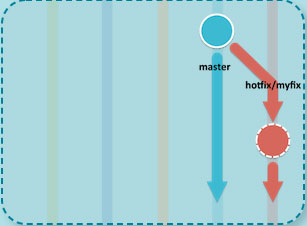

# How to make hotfixes?

Let's go through procedure of making hotfixes in gitflow.

Firstly - don't panic - it happens.

1. Just `checkout` to `master` and make sure you have updated changes with origin.
2. Create branch from master:

3. **Merge** it to master
4. **Merge** it to dev

Whole flow it's presented on the screen:

